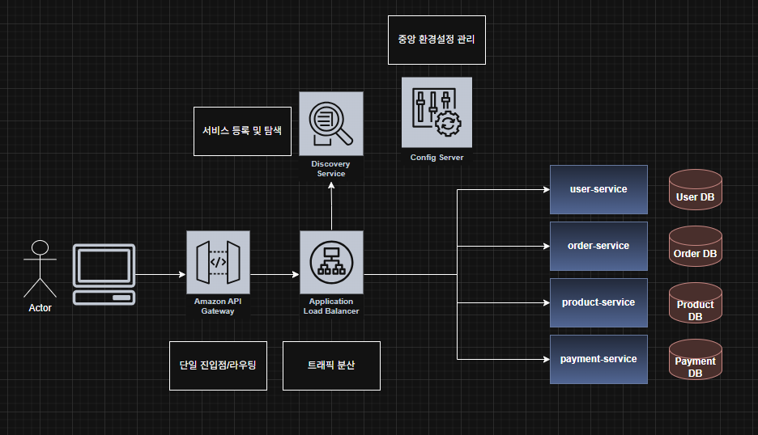

[TIL] 2026-07-08 | 로드밸런서와 API-gateway, 서킷 브레이커

유레카: 직원들끼리 서로의 내선번호를 찾는 사내 전화번호부
API gateaway: 안내데스크, 내선번호로 연결해줌

spring cloud gateway
1. Route - 게이트웨이의 문장 하나
	-라우트의 목록, mapping만 해줌
	-~한 요청이 오면(predicate) ~를 하면서(filter) ~로 보내라(url)
2. Predicate = 어떤 요청인가를 판별
	-Path =/oreders/**  -> /orders로 시작하는 모든 경로
3. Filter: 지나가는 길목에서 한번에 처리 
4. lb://
	
서킷브레이커 = 두꺼비집
일부러 다운을 해서 장애가 번지는 것을 막음

	

---
SPOF: 단일 실패지점 (비행기 엔진이 1개라면 그 엔진이 SPOF )